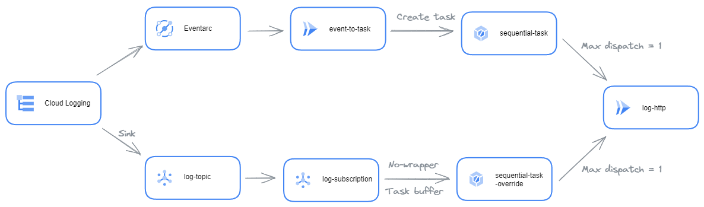

# Overview

This repository presents 3 different ways to implement an event driven architecture from events in Cloud Logging 
(typically, audit logs) to Cloud Tasks to control the delivery rate and invoke endpoints (when quotas apply).
1. Use Eventarc to invoke a Cloud Run service that reposts the event in Cloud Task
2. Use Cloud logging sink to send events to PubSub and then to Cloud Tasks (using a task buffer and URL override).
3. Hack the Eventarc configuration to mix the event capturing of Eventarc, and the simplicity of Cloud Task buffer

This [article](https://medium.com/google-cloud/cloud-logging-events-add-rate-limiting-to-preserve-resources-573abe080f51) 
presents that repository and the problems it addresses*

# Architecture schema

Here a diagram to visualise the architecture. In red, it's the hack option, a mix between both

# Deployment

To deploy the 3 options, you can run the `command.sh` files. The tracked events are job completion in BigQuery (_these 
are the only audit logs activated by default and do not require extra configuration for this demo_)

The pros and cons are discussed in the Medium article

## Common resources

To validate the correct event propagation, I propose a service that simply logs the request headers and body in the
logs. The `log-http` service is dedicated to this. _To simplify the demo, this service is deployed without 
authentication_

## The Eventarc option

This option requires an intermediary Cloud Run service because Eventarc can't deliver events to any HTTPS URL. A 
standard Cloud Task queue is created for this option 

Therefore, the `event-to-task` service must be deployed to copy the source event to Cloud Task (headers and body are 
copied as-is). The service requires parameters:
* The task queue name
* The endpoint to invoke for each task (if you use a task queue URL override, you can put this value to anything, 
such as `https://www.google.com`). Here it's the `log-http` Cloud Run service endpoint

The service account of this service required to have the permission to publish in the Cloud Task. _To simplify the demo,
this service is deployed without authentication_

The Eventarc service requires a service account with the event receiver permissions, and publishes events to the 
`event-to-task` Cloud Run service

## The Cloud logging sink option

This option is mainly based on Google Cloud services configuration and Cloud Tasks new features. It requires a Cloud Task 
queue with the [URL override](https://cloud.google.com/tasks/docs/configuring-queues#configure_queue-level_routing_for_http_tasks)
option to forward all the tasks to the `log-http` Cloud Run service endpoint, regardless of the URL set in the task 
itself.

A Cloud Logging sink is created on the logs and the events are published to PubSub topic. The trick here is that 
Cloud Logging create its own service account, which you must grant permissions to after creating the sink to allow it 
to publish events to the Pub/Sub topic.

On PubSub topic, a push subscription is created to push event to the Cloud Task queue on a 
[Task buffer endpoint](https://cloud.google.com/tasks/docs/creating-http-target-tasks#basic_task_creation_buffertask_method) 
This endpoint is a simplified endpoint, but ideal for our purpose. In addition, the pubsub subscription is created with 
the no wrapper option, which de-encapsulate the standard PubSub message (base64 encoded payload) and publishes message 
body (the log entry) in JSON format

## The Eventarc hack option

**This solution is not recommended for production use because it can break without any warning**

The idea is to let Eventarc configuring Google Cloud for us and to update the created (by Eventarc) PubSub subscription
to route the events to the Cloud Task URL override queue.

To differentiate the 3 types of route, I created a new Cloud Task queue name.

## Test it

To test it, simply create a query in BigQuery (for instance `SELECT 1`) and observe the logs of the `log-http`
Cloud Run service. In the headers `X-Cloudtasks-Queuename` you can see the 3 Cloud Task origin, proving the correct 
propagation of the event across the 3 options.

# Licence

This library is licensed under Apache 2.0. Full license text is available in
[LICENSE](https://github.com/guillaumeblaquiere/log-to-sequential-task/tree/main/LICENSE).