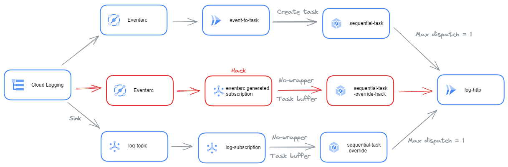

# Overview

This repository present 2 ways to implement an event driven architecture from event in Cloud Logging (typically, 
audit logs) to Cloud Tasks to be able to control the delivery rate to invoke the endpoints (when quotas apply).
1. Use Eventarc to invoke a first Cloud Run which repost the event in Cloud Task
2. Use Cloud logging sink, to PubSub, to Cloud Task (task buffer + URL Override)

This [article]() 
presents that repository and the problems it tackles*

# Architecture schema

Here a diagram to visualise the architecture

# Deployment

To deploy the 2 options, you can run the `command.sh` files. The tracked event are job completed in BigQuery (_it's the
only audit logs activated by default and does not require extra config for this demo_)

The pros and cons are discussed in the medium article

## Common resources

To validate the correct event propagation, I propose a service that simply log the requests headers and body in the
logs. The service `log-http` is dedicated to this. _To simplify the demo, this service is deployed with any
authentication_

## The Eventarc option

This option requires an intermediary Cloud Run service because Eventarc can't deliver events to any HTTPS URL. A 
standard Cloud Task queue is created for this option 

Therefore, the `event-to-task` service must be deployed to copy source event to Cloud Task (headers and body are copied 
as-is). The service requires parameters:
* The task queue name
* The endpoint to invoke for each task (if you use a task queue URL override, you can put this value to anything, 
`https://www.google.com` for instance). Here it's the `log-http` Cloud Run service endpoint

The service account of this service required to have the permission to publish in the Cloud Task. _To simplify the demo,
this service is deployed with any authentication_

The Eventarc service requiare a service account with the event receiver permissions, and publish event to the 
`event-to-task` cloud run service

## The Cloud logging sink option

This option is mainly based on configuration of Google Cloud and new feature of Cloud Tasks. It requires a Cloud Task 
queue with the [URL override](https://cloud.google.com/tasks/docs/configuring-queues#configure_queue-level_routing_for_http_tasks)
option to forward automatically the task to the `log-http` Cloud Run service endpoint, whatever the URL set in the 
task itself.

A Cloud Logging sink is created on the logs and the events published in a PubSub topic. The trick here is that 
Cloud Logging create its own service account that you have to grant after the sink creation to allow it to publish 
events to the PubSub topic.

On PubSub topic, a push subscription is created to push event to the Cloud Task queue on a 
[Task buffer endpoint](https://cloud.google.com/tasks/docs/creating-http-target-tasks#basic_task_creation_buffertask_method) 
This endpoint is a simplified endpoint, but ideal for what we want to do. The pubsub subscription is created with the 
no wrapper option, which de-encapsulate the PubSub standard message (payload base64 encoded) and publish message body
(the log entry) in JSON format

## Test it

To test it, simply create a query in BigQuery (for instance `SELECT 1`) and observe the logs of the `log-http`
Cloud Run service. In the headers you should see the 2 Cloud Task origin, proving the correct propagation of the event
across the 2 options.

# Licence

This library is licensed under Apache 2.0. Full license text is available in
[LICENSE](https://github.com/guillaumeblaquiere/log-to-sequential-task/tree/main/LICENSE).